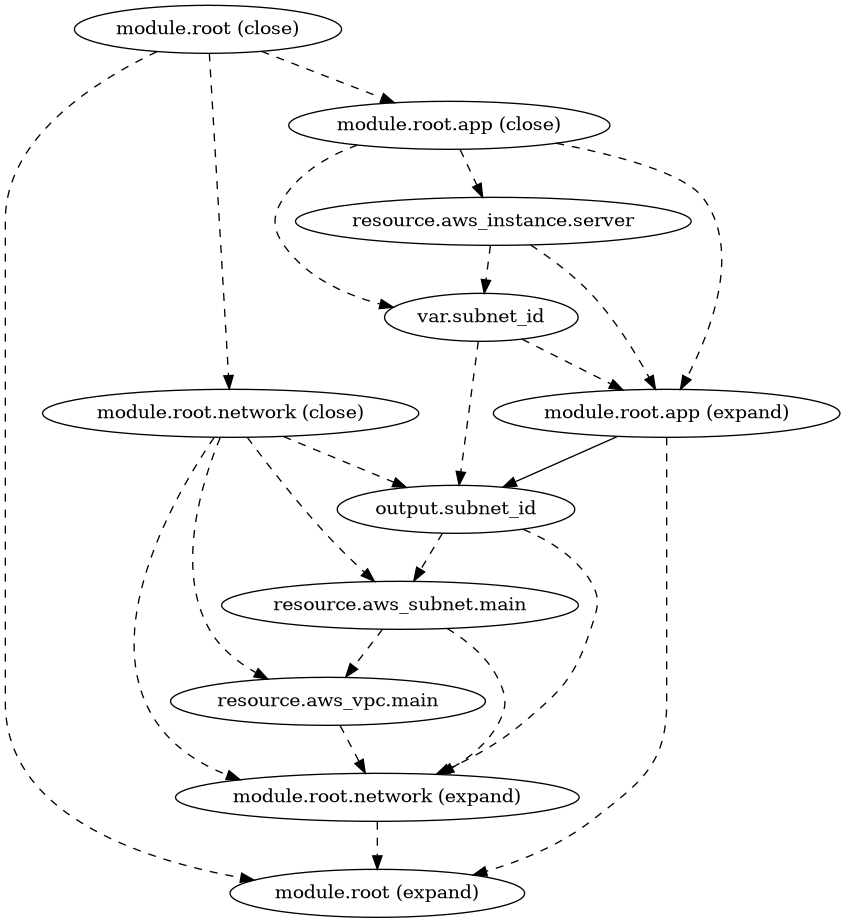

# depends_off

A tool that detects redundant Terraform dependencies. Refer to [the last section](#on-redundant-dependencies) for an explanation on why redundant dependencies should be avoided.

## Installation

To run the tool, create a virtual environment and install the required packages:

```
$ python3 -m venv env
$ source env/bin/activate
$ pip3 install -r requirements.txt
```

## Usage

To parse the dependency graph of a given module and detect redundancies, provide the tool with the path to the directory containing the module (or leave empty for the current directory). The `--graph` command can be used to to output the inferred dependency graph in DOT format, and the `--sarif` flag generate SARIF output.

```
$ python3 main.py [directory] [--graph path.dot] [--sarif]
```

## Examples

Several example Terraform modules demonstrating redundant dependencies can be found in the `examples` directory.

- `examples/1`: One of the simplest redundant `depends_on` usages.
- `examples/2`: Demonstrates the ability of the tool to detect redundant `depends_on` across a chain of implicit dependencies.
- `examples/3`: Multiple cases of redundant `depends_on` declarations in various parts of a dependency chain. It is also a good opportunity to use the tool's graph export to visualize the dependencies.
- `examples/4`: This example demonstrates redundant `depends_on` usage accross modules.

You can run the tool against any of them:

```
$ python3 main.py examples/1 [--graph graph.dot] [--sarif]
```

## On redundant dependencies

Redundant Terraform dependencies are explicit dependencies (declared with `depends_on`) that can be inferred using only [expression references](https://developer.hashicorp.com/terraform/language/expressions/references). The [Terraform documentation](https://developer.hashicorp.com/terraform/language/meta-arguments/depends_on#processing-and-planning-consequences) and several other sources advise against this:

> You should only use depends_on as a last resort because it can cause Terraform to create more conservative plans that replace more resources than necessary. For example, Terraform may treat more values as unknown "(known after apply)" because it is uncertain what changes will occur on the upstream object. This is especially likely when you use `depends_on` for modules.
> 
> Instead of `depends_on`, we recommend using expression references to imply dependencies when possible. Expression references let Terraform understand which value the reference derives from and avoid planning changes if that particular value hasn’t changed, even if other parts of the upstream object have planned changes.
>
> -- [Terraform documentation](https://developer.hashicorp.com/terraform/language/meta-arguments/depends_on#processing-and-planning-consequences)

As an example, consider the code below. Terraform can infer that only the subnet id input variable of `app` depends on `network.subnet_id`, but adding a redundant `depends_on` (commented in the code below) causes the entire `app` module to depend on the `subnet_id` output.

```tf
// main.tf

module "network" {
  source = "./modules/network"
}

module "app" {
  source     = "./modules/app"
  subnet_id = module.network.subnet_id
  # depends_on = [module.network.subnet_id]
}

// modules/network/main.tf

resource "aws_vpc" "main" {
  cidr_block = "10.0.0.0/16"
}

resource "aws_subnet" "main" {
  vpc_id     = aws_vpc.main.id
  cidr_block = "10.0.1.0/24"
}

output "subnet_id" {
  value = aws_subnet.main.id
}

// modules/app/main.tf

variable "subnet_id" {
  type = string
}

resource "aws_instance" "server" {
  ami                    = "ami-123"
  instance_type          = "t2.micro"
  subnet_id              = var.subnet_id
}
```

This can be visualized in `depends_off`'s output graph (image below). The true dependency is from `var.subnet_id` to `output.subnet_id`, but the extra `depends_on` makes the whole `app` module dependent on the output variable. If there were more items in the `app` module, they would be unnecessarily dependent on the variable, which could slow down deployment:



_Figure 1: Dependency graph as detected by `depends_off`. The `module.app` expand depends on the output variable, and any resources that are not dependent on the subnet id would be unnecessarily delayed during deployment._

Beyond efficiency concerns, duplicating code adds noise and complicates maintenance.
