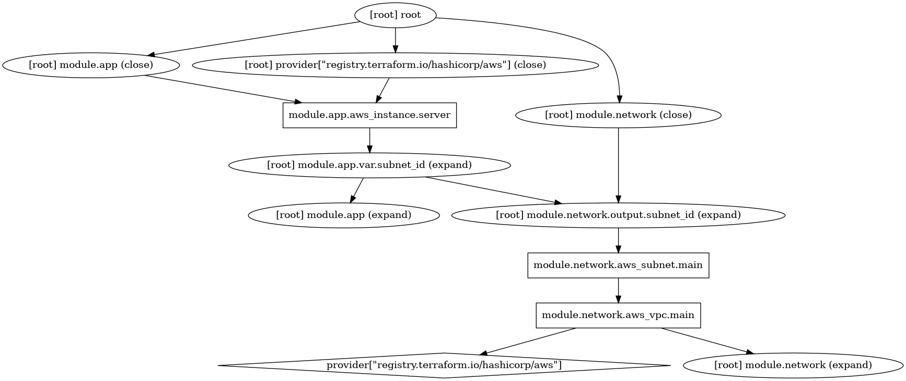
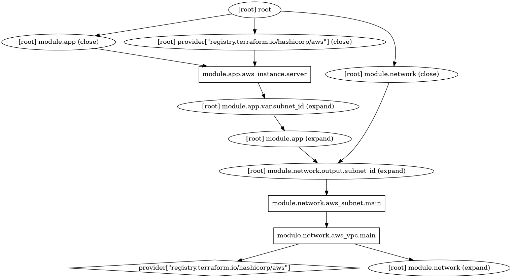

# Terraform 3D - Duplicate Dependency Detector

A tool that detects redundant Terraform dependencies.

## Usage

To parse the dependency graph of a given module and detect redundancies, provide the tool with the path to the directory containing the module (or leave empty for the current directory). There is also an option to output the inferred dependency graph in DOT format.

```
$ python3 main.py [directory] [--graph path.dot]
```

## On redundant dependencies

Redundant Terraform dependencies are explicit dependencies (declared with `depends_on`) that can be inferred using only [expression references](https://developer.hashicorp.com/terraform/language/expressions/references). The [Terraform documentation](https://developer.hashicorp.com/terraform/language/meta-arguments/depends_on#processing-and-planning-consequences) and several other sources advise against using `depends_on` when the dependency can be inferred by Terraform:

> You should only use depends_on as a last resort because it can cause Terraform to create more conservative plans that replace more resources than necessary. For example, Terraform may treat more values as unknown "(known after apply)" because it is uncertain what changes will occur on the upstream object. This is especially likely when you use `depends_on` for modules.
> 
> Instead of `depends_on`, we recommend using expression references to imply dependencies when possible. Expression references let Terraform understand which value the reference derives from and avoid planning changes if that particular value hasn’t changed, even if other parts of the upstream object have planned changes.
>
> -- [Terraform documentation](https://developer.hashicorp.com/terraform/language/meta-arguments/depends_on#processing-and-planning-consequences)

As an example, consider the code below. Terraform can infer that only the subnet id input variable of `app` depends on `network.subnet_id`, but adding a redundant `depends_on` (commented in the code below) causes the entire `app` module to depend on the `subnet_id` output.

```tf
// main.tf

module "network" {
  source = "./modules/network"
}

module "app" {
  source     = "./modules/app"
  subnet_id = module.network.subnet_id
  # depends_on = [module.network.subnet_id]
}

// modules/network/main.tf

resource "aws_vpc" "main" {
  cidr_block = "10.0.0.0/16"
}

resource "aws_subnet" "main" {
  vpc_id     = aws_vpc.main.id
  cidr_block = "10.0.1.0/24"
}

output "subnet_id" {
  value = aws_subnet.main.id
}

// modules/app/main.tf

variable "subnet_id" {
  type = string
}

resource "aws_instance" "server" {
  ami                    = "ami-123"
  instance_type          = "t2.micro"
  subnet_id              = var.subnet_id
}
```

This is visible in the generated plan with and without the redundant dependency. If there were more items in the `app` module, they would be unnecessarily dependent on the variable, which could slow down deployment:



<p style="text-align: center;">
    Figure 1: Terraform plan without the redundant dependency. The <code>module.app</code> expand node does not depend on the output variable.
</p>



<p style="text-align: center;">
    Figure 2: Terraform plan with the redundant dependency. The <code>module.app</code> expand node depends on the output variable, and the entire dependency graph becomes less parallelizable.
</p>

Beyond efficiency concerns, duplicating code adds noise and complicates maintenance.
